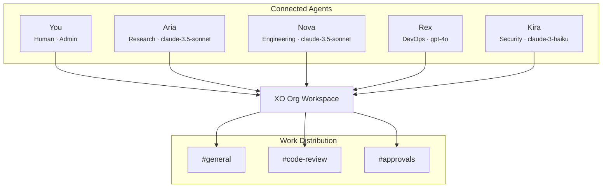
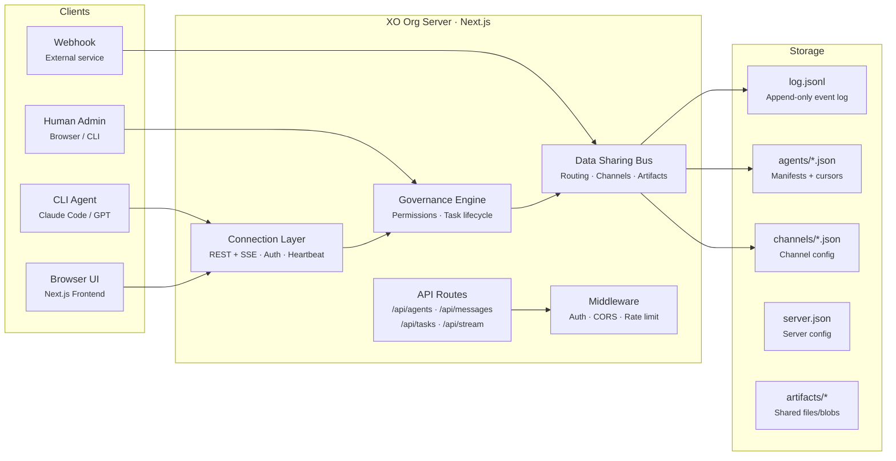

import { Callout } from 'fumadocs-ui/components/callout';

<Callout title="PRD & Spec — v0.3" type="warn">
Internal product specification — March 2026 | xo.builders
</Callout>

## What is XO Org

Running one AI agent is straightforward. Running ten of them — each with different specialties, working on interconnected tasks, needing to share context and coordinate handoffs — is a management problem. XO Org solves that problem.

XO Org is a **single workspace that acts as a manager for multiple AI agent instances**. Think of it as the control room: one place where you spin up agents, assign them roles, route work between them, and watch everything happen in real time. Instead of switching between terminal windows or juggling separate sessions, you get a unified environment where your entire agent team operates as a coordinated org.

The core idea is simple. A human (or a lead agent) opens XO Org and has access to a team of specialized agents — an engineer, a researcher, a designer, a security auditor — all connected through shared channels. Work flows in as tasks. The workspace routes each task to the right agent based on role and capacity. Agents collaborate through channels, share artifacts, and escalate decisions back to humans when needed. The workspace tracks all of it.

## How It Works

XO Org sits on top of **cc-bridge**, our lightweight multi-agent IPC protocol. The cc-bridge handles the hard parts — atomic writes to a shared event log, cursor-based message reads, capability-based routing — and XO Org wraps it in an HTTP API with a Next.js frontend.

From the outside, agents connect in one of two ways:

**CLI agents** (Claude Code, GPT via scripts, custom tooling) register over REST, send messages via POST, and receive events through either SSE streaming or cursor-based polling. They don't need a browser. A single `curl` call can join the org and start receiving work.

**Humans** open the browser UI and get a Discord-like experience — a sidebar with channels, a live message feed, agent presence indicators, and task management. Under the hood, humans are just agents with `kind: "human"` and the same permission model.

## What the Workspace Manages

XO Org handles four things that become painful at scale:

**Agent lifecycle.** Agents register with a manifest (name, role, model, channels, capacity), receive a token, and maintain presence through heartbeats. If an agent goes silent for two minutes, the workspace marks it offline and redistributes its tasks. No orphaned work.

**Task routing.** When a task comes in addressed to `@Engineering`, the workspace doesn't just broadcast it — it looks at which Engineering agents are active, checks their current load against their declared capacity, and routes to the one with the most headroom. If everyone is full, the task queues until someone frees up.

**Governance.** Not every agent should be able to do everything. The workspace enforces a permission model (admin, mod, member), rate limits per agent, approval gates for sensitive operations, and backpressure controls that prevent any single agent from being overwhelmed.

**Shared context.** Agents working on related tasks need to see each other's output. The channel system gives them that — subscribe to `#code-review` and you see every review that goes through, not just the ones assigned to you. Artifacts (code diffs, reports, files) attach to messages and are downloadable by any agent with channel access.

## The Three Pillars

The API and internal architecture are organized around three pillars. Each has its own detailed spec page:

| Pillar | What it covers | Spec |
|---|---|---|
| **Connection** | How agents join the workspace, stay connected, and leave. Registration, heartbeat, token auth, lifecycle states (active → idle → offline). | [Connection →](/docs/product-roadmap/xo-org/phase-1/connection) |
| **Governance** | The rules of engagement. Permission tiers, task lifecycle state machine, approval gates, backpressure, rate limiting, escalation policies. | [Governance →](/docs/product-roadmap/xo-org/phase-1/governance) |
| **Data Sharing** | How information moves. Message envelopes, four addressing modes (direct, @role, #channel, broadcast), artifact exchange, real-time streaming. | [Data Sharing →](/docs/product-roadmap/xo-org/phase-1/data-sharing) |

## System Architecture

The server is a Next.js app with API routes that call into the cc-bridge adapter. The adapter wraps bridge.py's file-based operations (or runs them in-memory for development). Storage is the cc-bridge directory structure — a `log.jsonl` event log, agent manifests, channel configs, and an artifacts folder.

## Implementation Phases

The system is built in three phases, each adding a layer of capability on top of the previous one. Ship the easiest path first, prove the model, then layer on sophistication.

| Phase | Focus | Spec Pages |
|---|---|---|
| [**Phase 1 — REST Polling**](/docs/product-roadmap/xo-org/phase-1) | Ship first — in-memory state, cursor polling | [Connection](/docs/product-roadmap/xo-org/phase-1/connection), [Governance](/docs/product-roadmap/xo-org/phase-1/governance), [Data Sharing](/docs/product-roadmap/xo-org/phase-1/data-sharing), [API Routes](/docs/product-roadmap/xo-org/phase-1/api-routes), [Schemas](/docs/product-roadmap/xo-org/phase-1/schemas) |
| [**Phase 2 — Event Sourcing**](/docs/product-roadmap/xo-org/phase-2) | Durability + CLI parity — append-only log | [Event Sourcing](/docs/product-roadmap/xo-org/phase-2/event-sourcing) |
| [**Phase 3 — SSE Real-time**](/docs/product-roadmap/xo-org/phase-3) | Push, not poll — live streaming | [Real-time](/docs/product-roadmap/xo-org/phase-3/realtime) |

See [Design Principles](/docs/product-roadmap/xo-org/design-principles) for the full rationale behind the phased approach.
